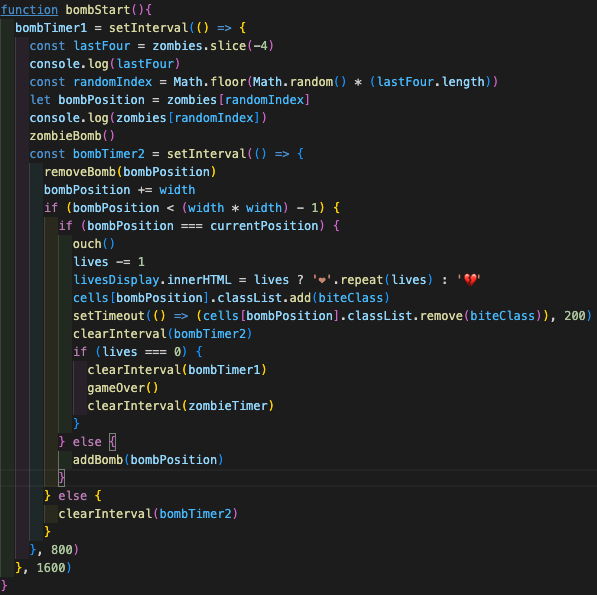

# SEI-65-Projects
## Walking Dead Invaders

 

### Description

In the fourth week of our course, we were tasked with making a retro game.  I made a variant of the hit game Space Invaders, with a Zombie twist towards the TV series The Walking Dead.  To complete the project I used HTML, CSS and JavaScript.  This was written using VS Code, iterations uploaded regularly using Git and deployed through GitHub.   

### Deployment Link 

https://markmuy40.github.io/SEI-65-Projects/

### Getting Started/Code Installation 

Go to:  https://www.github.com/

Type: SEI-65-projects in the search box

Select: markmuy40/SEI-65-projects
 

### Timeframe And Working Team 

This was a 5 day solo project.

### Technologies Used 

##### HTML
•	Created a boiler plate and set up to ensure communication between the scripts.
•	div layout to allow for better manipulation in CSS and JavaScript.
•	Added audio elements.
##### CSS
•	Extensive use of flexbox to manipulate the layout of the webpage.  Future planning for mobile platform. 
•	Characters and other styling components.
•	Overall styling.
##### JavaScript
•	All in-game functions and player interactions.
•	Using keycodes to allow multiple keys for player actions.
•	Click events for reset and start buttons.
•	Added audio using multiple channels.
•	Changing images to show hits from projectiles and attacks.
•	Automating movement using JavaScript time.

##### Google Chrome 

•	Developer Tools used for layout, CSS manipulation and using the console for debugging and working through logic. 

### Brief

The brief was to create a version of Space Invaders.

##### Requirements:
•	The player should be able to clear at least one wave of aliens.
•	The player’s score should be displayed at the end of the game.

##### Challenges
•	The main challenge here is the movement of large groups of aliens in formation and the animation of the bombs and player’s shots.  There are several approaches here with collision detection being the more challenging. 

### Planning 

Excalidraw used to sketch plans, ideas, and concepts for my design and thoughts behind the processes involved. I wrote down ideas on the functions I would need to create in plain text.  This would help in pseudo coding.  

 
##### Timeline

During the planning phase, a timeline was important to keep on track of schedule and allow time for snags and unexpected speedhumps.

#### **Pseudo code**
 

The Pseudo code was an extension to what I wrote in my initial plans. A hybrid between the plain text and actual code.  Whilst these functions aren’t a working product, they gave me a stronger base to work from.

### Build/Code Process 

#### Initial script setup

With all the previous planning in place I had a structure to follow. I started with the boilerplate, set up my HTML with relevant containers, and made the CSS to match.  This made it easier to reference.  I also added in the initialising function, so at this point both the JavaScript and CSS scripts were talking to the HTML, checking the file paths were correct. 

##### Building the grid and DOM elements

Next part of the plan was to build the grid using a JavaScript function.  Wireframing functions in JavaScript with the headers; variables, execution and event helped to add structure to the process.  Broke it down further with sectons for player functions, zombie movement and projectiles.  I also added in DOM elements and checked they were targeting the HTML element, verified using the Google Chrome developer tool.  

##### Order of functions to be built
                  
I had an order of coding for quick wins to give me more time in the later stages for the trickier functions.

I also theorised that some of the functions were similar and could be used to rework the code for other functions. For example, player movement (with additional keycode input) and projectiles, with zombie projectiles being automated with timers. Then I had a code I could adapt for zombie movement, automating it with timers and the same for the bombs/rushing zombies

##### Working through problems methodically 

Throughout the process I spent time researching and checking my work.  I took breaks from coding to work on other aspects, like design and image collecting, ensuring all aspects were being worked on. This kept the timeline moving forward and aided in the learning process.  Using the console log was instrumental in fault finding and diagnostics with code errors and unexpected movement.

##### Finalising and clean up 

The final parts were clean-up of code, reformatting into an easily readable state and making functions easy to find when I decide to improve it later. 

### Challenges 

I enjoyed getting plans and ideas drawn out, but I also realised the game was a bigger undertaking than first thought 

It took time to understand scope in JavaScript, with global and internal variables, and the effect it has on JavaScript time.  Whilst I understood the theory, this caused havoc with the timers used for automating functions.  Certain functions were accelerating the time intervals within the nested setInterval. Methodically, I went through the logic in steps. I used the console log to diagnose and understand where the issues were. You could see the accelerated movement produced and the glitchy playthrough.  

I found it tricky to work the playerShoot function.  It contains 3 if statements, each nested inside the other:
•	The firing conditions.
•	Projectile movement. 
•	Points and hit conditions.  
By breaking down each step, before and after the condition being met, helped to work through the problem. 

 
 In a similar vein, the bombStart function was a fun challenge to work through as the time I had left to finish the project was tight.  It had three ‘if’ statements, nested within one another and inside two setInterval timers.  This was both a real challenge and satisfying when it worked. Many events are handled within one function. 
In both situations, using and understanding how to manipulate the console log and analysing readouts were key to success.

### Wins
 
I have a working game that met all the requirements; a Space Invaders game based on The Walking Dead series, styled to look like a 90’s themed arcade machine.

The playerShoot function contains multiple nested ‘if’ statements.  I’m proud of how I worked it through, with each nested statement working off the previous, leading to the desired outcome.  This was a great way of expanding on the capability of one function.

In a similar vein, the bombStart function was a fun challenge to work through as the time I had left to finish the project was tight.  It had three ‘if’ statements, nested within one another and inside two setInterval timers.  This was both a real challenge and satisfying when it worked. Many events are handled within one function. 

I got to grips with the process of problem solving and working methodically, finding ways of diagnosing when functions were not working as expected, enabling me to resolve them quicker. 

### Key Learnings/ Takeaways

>‘Everyone has a plan until they get punched in the mouth' - Mike Tyson

I am better prepared for planning future projects, thinking about the detail and function structure.  I planned a hybrid of pseudo code and looking back, they weren’t far off the actual coding. Making an ERD would set me up for planning functions better.

By adding all the above into a project management tool, I would gain more time to reach the stretch goals.  This goes back to the idea of spending quality time planning, so the sprint is more purposeful.

Global versus internal scope.  I understood the difference, but I feel more comfortable using them in practical terms and its effect on time in JavaScript.

Diagnostic testing and problem solving at each stage of writing a function was vital to the whole project. Checking for desired outcome, and if not, why it happened.  This gave me real confidence in how to work through problems. 

My progress using HTML, CSS, JavaScript, and the Google Chrome Developer tool, from week one onto this project, have become some of my real strengths.  From creating the different sections in HTML and manipulating them through CSS to create a design that is thematic and a good fit for what I wanted to achieve. 

### Bugs

•	On the main screen you can move and start shooting the zombies before you have pressed start, so the zombies aren’t firing back/ running at you.
•	The game continues to run, and some sounds end up being looped after you close the game end alert.

### Future Improvements
 
•	Go back and debug the issues mentioned previously.
•	Create end game screens rather than use window alerts.
•	Make an intro screen.
•	Improve on the overall look.  
•	Add in animations.
